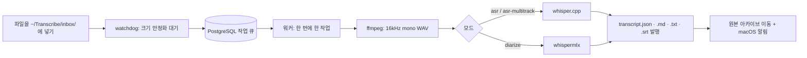

# transcribe-inbox

[English](README.md) | **한국어** | [简体中文](README.zh-CN.md)


-lightgrey)

[](https://chuseok22.github.io/transcribe-inbox/ko/)

폴더에 녹음 파일을 넣으면, Apple Silicon에서 로컬로 전사해 노트에 발행합니다.

> **macOS + Apple Silicon 전용**입니다. Linux와 Windows, Intel Mac은 지원하지 않습니다.

<!-- 데모 GIF 자리: 사용자 제공 후 삽입 -->

특정 폴더를 감시하다가 새로 들어온 녹음 파일(오디오 또는 비디오)을 자동으로 전사해 Obsidian vault(또는 일반 폴더)에 발행하는 로컬 백그라운드 데몬입니다. whisper.cpp / whispermlx 하이브리드 엔진을 쓰며 클라우드 API 호출은 없습니다.

`ffmpeg`가 오디오를 디코딩할 수 있는 포맷이면 오디오든 비디오든 상관없습니다. 파이프라인은 파일 확장자를 검사하지 않고 `ffmpeg`로 오디오 스트림만 추출하며, 무음 구간을 잘라내지 않으므로 전사 결과의 타임스탬프는 항상 원본과 일치합니다. `ffmpeg`가 열지 못하는 파일은 그 작업만 실패 처리되고 데몬과 다른 작업에는 영향을 주지 않습니다.

## 주요 특징

- **완전 로컬, 프라이버시 우선**: 모든 처리가 내 Mac에서 이루어지며 클라우드 API를 호출하지 않습니다.
- **폴더 구조가 곧 설정**: 파일을 어느 깊이의 폴더에 놓느냐로 카테고리와 모드가 결정됩니다. 설정 파일도, 파일명 규칙도 없습니다.
- **3가지 모드**: 단일 화자 `asr`, 화자별로 나뉜 트랙을 합치는 `asr-multitrack`, 한 파일의 여러 화자를 구분하는 `diarize`.
- **멱등 큐잉과 상태 복구**: 내용 해시로 판별하므로 같은 내용의 파일은 중복 등록되지 않고, 데몬이 재시작되어도 중단된 작업의 상태를 스스로 정합니다.
- **요약 없이 원문 그대로 발행**: 결과는 `transcript.json`(정본), `.md`, `.txt`, `.srt`로 나옵니다. 요약은 사용자가 직접 합니다.
- **Obsidian 없이도 사용 가능**: 결과는 일반 폴더에 쓰이는 Markdown, JSON, SRT 파일이라 어떤 도구로도 열 수 있습니다.

## 동작 흐름

파일이 인박스에 들어오면 다음 순서로 처리됩니다. 작업은 한 번에 하나씩 순차 실행됩니다.



## 요구 사항

- macOS + Apple Silicon
- 로컬에서 실행 중인 PostgreSQL (작업 큐와 상태 저장소)
- `ffmpeg`
- `whisper-cli`(whisper.cpp)와 모델 파일 2개 (ASR 모델 `ggml-large-v3.bin`, VAD 모델 `ggml-silero-v6.2.0.bin`)
- `uv` (Python 의존성 설치)
- `diarize` 모드에서만: HuggingFace **Read** 토큰과 화자분리 모델 약관 동의

항목별 설치 방법은 [사전 준비물](https://chuseok22.github.io/transcribe-inbox/ko/getting-started/prerequisites)과 [설치 가이드](https://chuseok22.github.io/transcribe-inbox/ko/getting-started/installation)를 참고하세요.

## 빠른 시작

처음 설치하는 경우의 최소 단계입니다. 설치가 끝나면 `~/Transcribe/inbox/` 아래에 녹음 파일을 넣기만 하면 됩니다.

PostgreSQL 데이터베이스 생성과 스키마 적용, 모델 2개 다운로드가 먼저 필요합니다 — [설치 가이드](https://chuseok22.github.io/transcribe-inbox/ko/getting-started/installation) 참고.

```sh
brew install ffmpeg whisper-cpp
uv sync   # DB 스키마 적용·모델 다운로드는 설치 가이드 참고
cp launchd/com.chuseok22.transcribe-inbox.plist.example launchd/com.chuseok22.transcribe-inbox.plist   # 값을 채우세요
cp launchd/com.chuseok22.transcribe-inbox.plist ~/Library/LaunchAgents/ && launchctl load ~/Library/LaunchAgents/com.chuseok22.transcribe-inbox.plist
```

plist에 `uv`, `whisper-cli`, 모델 파일의 절대 경로와 `DATABASE_URL` 등을 채워야 데몬이 실행됩니다. 자세한 설정은 [문서](https://chuseok22.github.io/transcribe-inbox/ko/)를 참고하세요.

## 문서

전체 문서는 [https://chuseok22.github.io/transcribe-inbox/ko/](https://chuseok22.github.io/transcribe-inbox/ko/)에서 볼 수 있습니다.

- **시작하기**: [사전 준비물](https://chuseok22.github.io/transcribe-inbox/ko/getting-started/prerequisites), [설치](https://chuseok22.github.io/transcribe-inbox/ko/getting-started/installation)
- **가이드**: [인박스 폴더 구조](https://chuseok22.github.io/transcribe-inbox/ko/guide/inbox-layout), [모드](https://chuseok22.github.io/transcribe-inbox/ko/guide/modes), [사용법](https://chuseok22.github.io/transcribe-inbox/ko/guide/usage)
- **레퍼런스**: [설정](https://chuseok22.github.io/transcribe-inbox/ko/reference/configuration), [출력 형식](https://chuseok22.github.io/transcribe-inbox/ko/reference/output)
- **문제 해결**: [문제 해결](https://chuseok22.github.io/transcribe-inbox/ko/help/troubleshooting), [알려진 한계](https://chuseok22.github.io/transcribe-inbox/ko/help/known-limitations)

## 알려진 한계

현재 알려진 한계는 다음과 같습니다.

- whisper.cpp가 특정 git 태그/커밋에 고정되어 있지 않아, `brew install whisper-cpp`로 받은 `stable` 버전이 바뀌면 동작이 달라질 수 있습니다.
- `diarize` 모드는 실제 녹음을 대상으로 한 end-to-end 테스트를 아직 거치지 않았습니다. 의존하기 전에 한 번 스모크 테스트를 해보세요.
- 서로 다른 두 녹음이 같은 카테고리와 라벨로 귀결되면 전사 결과 디렉터리가 덮어써집니다. 원본 오디오는 내용 해시 접미사로 보호되지만 전사 결과는 아직 그렇지 않습니다.
- `HUGGINGFACE_TOKEN`은 (gitignore 처리된) plist 파일에 직접 넣어야 하며, 키체인이나 별도 시크릿 파일은 아직 지원하지 않습니다.
- 인박스 루트에 바로 놓은 파일의 카테고리 이름 `미분류`는 코드에 고정되어 있어 바꿀 수 없습니다.
- 전사 언어가 현재 한국어(`ko`)로 고정되어 있습니다. 다른 언어는 아직 설정할 수 없습니다.

자세한 내용은 [알려진 한계](https://chuseok22.github.io/transcribe-inbox/ko/help/known-limitations) 페이지를 참고하세요.

## 기여하기

기여 방법은 [CONTRIBUTING.md](CONTRIBUTING.md)를 참고하세요. README를 수정할 때는 한국어(`README.ko.md`)를 원본으로 삼아 영어와 중국어 번역본도 함께 갱신합니다.

## 라이선스

MIT — [LICENSE](LICENSE)
