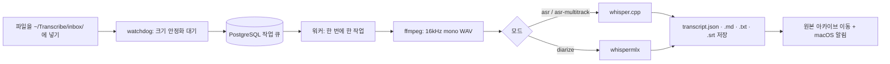

# transcribe-inbox

[English](README.md) | **한국어** | [简体中文](README.zh-CN.md)


-lightgrey)

[](https://chuseok22.github.io/transcribe-inbox/ko/)

폴더에 녹음 파일을 넣으면 Apple Silicon Mac에서 로컬로 전사해 노트 폴더에 저장합니다.

> **macOS + Apple Silicon 전용**입니다. Linux와 Windows, Intel Mac은 지원하지 않습니다.

<!-- 데모 GIF 자리: 사용자 제공 후 삽입 -->

지정한 폴더를 감시하다가 새로 들어온 녹음 파일(오디오 또는 비디오)을 자동으로 전사하는 로컬 백그라운드 데몬입니다. 결과는 Obsidian vault나 일반 폴더에 저장합니다. 엔진은 whisper.cpp와 whispermlx를 함께 쓰며, 클라우드 API는 호출하지 않습니다.

`ffmpeg`가 오디오를 디코딩할 수 있는 포맷이면 오디오와 비디오 모두 처리합니다. 파이프라인은 파일 확장자를 검사하지 않고 `ffmpeg`로 오디오 스트림만 추출합니다. 무음 구간을 잘라내지 않으므로 전사 결과의 타임스탬프는 항상 원본과 일치합니다. `ffmpeg`가 열지 못하는 파일은 해당 작업만 실패하며, 데몬과 다른 작업은 영향을 받지 않습니다.

## 주요 특징

- 로컬 처리: 모든 처리를 내 Mac에서 하며 클라우드 API를 호출하지 않습니다.
- 폴더 구조로 설정: 파일을 어느 깊이의 폴더에 두는지에 따라 카테고리와 모드가 정해집니다. 설정 파일이나 파일 이름 규칙은 없습니다.
- 모드 3가지: 단일 화자용 `asr`, 화자별 트랙을 합치는 `asr-multitrack`, 한 파일 안의 여러 화자를 구분하는 `diarize`가 있습니다.
- 중복 방지와 상태 복구: 파일 내용의 해시로 판별하므로 같은 내용의 파일은 다시 등록되지 않습니다. 데몬이 재시작되면 중단된 작업의 상태를 다시 맞춥니다.
- 원문 그대로 저장: 결과는 `transcript.json`(정본), `.md`, `.txt`, `.srt`입니다. 요약은 하지 않으므로 필요하면 직접 합니다.
- Obsidian 없이도 사용 가능: 결과는 일반 폴더에 저장되는 Markdown, JSON, SRT 파일이라 다른 도구로도 열 수 있습니다.

## 동작 흐름

인박스에 들어온 파일은 아래 순서로 처리됩니다. 작업은 한 번에 하나씩 순서대로 실행합니다.



## 요구 사항

- macOS + Apple Silicon
- 로컬에서 실행 중인 PostgreSQL (작업 큐와 상태 저장소)
- `ffmpeg`
- `whisper-cli`(whisper.cpp)와 모델 파일 2개 (ASR 모델 `ggml-large-v3.bin`, VAD 모델 `ggml-silero-v6.2.0.bin`)
- `uv` (Python 의존성 설치용)
- `diarize` 모드를 쓸 때만: HuggingFace Read 권한 토큰과 화자분리 모델 약관 동의

항목별 설치 방법은 [사전 준비물](https://chuseok22.github.io/transcribe-inbox/ko/getting-started/prerequisites)과 [설치 가이드](https://chuseok22.github.io/transcribe-inbox/ko/getting-started/installation)를 참고하세요.

## 빠른 시작

처음 설치할 때 필요한 최소 단계입니다. 설치가 끝나면 `~/Transcribe/inbox/` 아래에 녹음 파일을 넣으면 됩니다.

먼저 PostgreSQL 데이터베이스를 만들어 스키마를 적용하고, 모델 2개를 내려받아야 합니다. 방법은 [설치 가이드](https://chuseok22.github.io/transcribe-inbox/ko/getting-started/installation)에 있습니다.

```sh
brew install ffmpeg whisper-cpp
uv sync   # DB 스키마 적용·모델 다운로드는 설치 가이드 참고
cp launchd/com.chuseok22.transcribe-inbox.plist.example launchd/com.chuseok22.transcribe-inbox.plist   # 값을 채우세요
cp launchd/com.chuseok22.transcribe-inbox.plist ~/Library/LaunchAgents/ && launchctl load ~/Library/LaunchAgents/com.chuseok22.transcribe-inbox.plist
```

데몬을 실행하려면 plist에 `uv`, `whisper-cli`, 모델 파일의 절대 경로와 `DATABASE_URL` 등을 채워야 합니다. 자세한 설정은 [문서](https://chuseok22.github.io/transcribe-inbox/ko/)를 참고하세요.

## 문서

전체 문서는 [https://chuseok22.github.io/transcribe-inbox/ko/](https://chuseok22.github.io/transcribe-inbox/ko/)에 있습니다.

- 시작하기: [사전 준비물](https://chuseok22.github.io/transcribe-inbox/ko/getting-started/prerequisites), [설치](https://chuseok22.github.io/transcribe-inbox/ko/getting-started/installation)
- 가이드: [인박스 폴더 구조](https://chuseok22.github.io/transcribe-inbox/ko/guide/inbox-layout), [모드](https://chuseok22.github.io/transcribe-inbox/ko/guide/modes), [사용법](https://chuseok22.github.io/transcribe-inbox/ko/guide/usage)
- 레퍼런스: [설정](https://chuseok22.github.io/transcribe-inbox/ko/reference/configuration), [출력 형식](https://chuseok22.github.io/transcribe-inbox/ko/reference/output)
- 문제 해결: [문제 해결](https://chuseok22.github.io/transcribe-inbox/ko/help/troubleshooting), [알려진 한계](https://chuseok22.github.io/transcribe-inbox/ko/help/known-limitations)

## 알려진 한계

현재 알려진 한계는 다음과 같습니다.

- whisper.cpp가 특정 git 태그나 커밋에 고정되어 있지 않습니다. `brew install whisper-cpp`로 받는 `stable` 버전이 바뀌면 동작이 달라질 수 있습니다.
- `diarize` 모드는 실제 녹음으로 end-to-end 테스트를 아직 하지 않았습니다. 이 모드에 의존하기 전에 스모크 테스트를 한 번 해 보세요.
- 서로 다른 두 녹음의 카테고리와 라벨이 같으면 전사 결과 디렉터리를 덮어씁니다. 원본 오디오는 내용 해시 접미사로 보호되지만 전사 결과는 아직 보호되지 않습니다.
- `HUGGINGFACE_TOKEN`은 gitignore에 등록된 plist 파일에 직접 넣어야 합니다. 키체인이나 별도 시크릿 파일은 아직 지원하지 않습니다.
- 인박스 루트에 바로 둔 파일의 카테고리 이름 `미분류`는 코드에 고정되어 있어 바꿀 수 없습니다.
- 전사 언어는 현재 한국어(`ko`)로 고정되어 있습니다. 다른 언어는 아직 설정할 수 없습니다.

자세한 내용은 [알려진 한계](https://chuseok22.github.io/transcribe-inbox/ko/help/known-limitations) 페이지를 참고하세요.

## 기여하기

기여 방법은 [CONTRIBUTING.md](CONTRIBUTING.md)를 참고하세요. README를 수정할 때는 한국어판(`README.ko.md`)을 원본으로 삼고, 영어와 중국어 번역본도 함께 고칩니다.

## 라이선스

MIT 라이선스입니다. [LICENSE](LICENSE)를 참고하세요.
