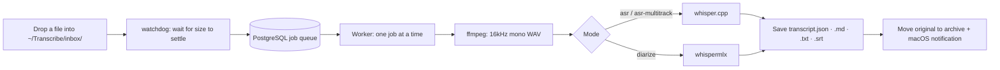

# transcribe-inbox

<!-- AUTO-VERSION-SECTION: DO NOT EDIT MANUALLY -->
## Latest Version : v0.3.0 (2026-09-26)

**English** | [한국어](README.ko.md) | [简体中文](README.zh-CN.md)


-lightgrey)

[](https://chuseok22.github.io/transcribe-inbox/)

Drop audio into a folder. Get a transcript in your notes. Fully local on Apple Silicon.

> **macOS + Apple Silicon only.** Linux, Windows and Intel Macs are not supported.

<!-- Demo GIF placeholder: insert after the user provides the recording -->

transcribe-inbox is a local background daemon. It watches a folder and transcribes new recordings (audio or video) as they arrive. Results go to an Obsidian vault or a plain folder. The engines are whisper.cpp and whispermlx, and no cloud API is called.

Any file that `ffmpeg` can decode audio from works, audio or video. The pipeline does not check file extensions. It extracts the audio stream with `ffmpeg` and does not trim silence, so transcript timestamps always match the original. If `ffmpeg` cannot open a file, only that job fails. The daemon and other jobs keep running.

## Features

- Local processing: everything runs on your Mac. No cloud API is called.
- Folder structure as configuration: the folder depth where you put a file sets its category and mode. There is no config file and no file naming rule.
- Three modes: `asr` for a single speaker, `asr-multitrack` to merge per-speaker tracks, and `diarize` to separate several speakers in one file.
- Duplicate prevention and state recovery: files are identified by a hash of their content, so a file with the same content is not registered again. After a restart, the daemon brings interrupted jobs back to a consistent state.
- Verbatim output: results are `transcript.json` (the canonical file), `.md`, `.txt` and `.srt`. Nothing is summarized. Summarize them yourself if you need to.
- Obsidian is optional: the output is Markdown, JSON and SRT files in a regular folder, so other tools can open them.

## How it works

A file that lands in the inbox goes through the steps below. Jobs run one at a time, in order.



## Requirements

- macOS + Apple Silicon
- PostgreSQL running locally (job queue and state store)
- `ffmpeg`
- `whisper-cli` (whisper.cpp) and two model files (the ASR model `ggml-large-v3.bin` and the VAD model `ggml-silero-v6.2.0.bin`)
- `uv` (installs the Python dependencies)
- For `diarize` mode only: a HuggingFace token with Read permission, and acceptance of the diarization model's terms

For install steps for each item, see [Prerequisites](https://chuseok22.github.io/transcribe-inbox/getting-started/prerequisites) and the [Installation guide](https://chuseok22.github.io/transcribe-inbox/getting-started/installation).

## Quick start

These are the minimum steps for a first install. Once it is set up, put recordings under `~/Transcribe/inbox/`.

Before this, create the PostgreSQL database, apply the schema and download the two models. The [Installation guide](https://chuseok22.github.io/transcribe-inbox/getting-started/installation) covers how.

```sh
brew install ffmpeg whisper-cpp
uv sync   # for DB schema and model downloads, see the installation guide
cp launchd/com.chuseok22.transcribe-inbox.plist.example launchd/com.chuseok22.transcribe-inbox.plist   # fill in the values
cp launchd/com.chuseok22.transcribe-inbox.plist ~/Library/LaunchAgents/ && launchctl load ~/Library/LaunchAgents/com.chuseok22.transcribe-inbox.plist
```

To run the daemon, fill in the plist with the absolute paths of `uv`, `whisper-cli` and the model files, plus `DATABASE_URL` and the other keys. For the full configuration, see the [documentation](https://chuseok22.github.io/transcribe-inbox/).

## Documentation

The full documentation is at [https://chuseok22.github.io/transcribe-inbox/](https://chuseok22.github.io/transcribe-inbox/).

- Getting started: [Prerequisites](https://chuseok22.github.io/transcribe-inbox/getting-started/prerequisites), [Installation](https://chuseok22.github.io/transcribe-inbox/getting-started/installation)
- Guide: [Inbox layout](https://chuseok22.github.io/transcribe-inbox/guide/inbox-layout), [Modes](https://chuseok22.github.io/transcribe-inbox/guide/modes), [Usage](https://chuseok22.github.io/transcribe-inbox/guide/usage)
- Reference: [Configuration](https://chuseok22.github.io/transcribe-inbox/reference/configuration), [Output format](https://chuseok22.github.io/transcribe-inbox/reference/output)
- Help: [Troubleshooting](https://chuseok22.github.io/transcribe-inbox/help/troubleshooting), [Known limitations](https://chuseok22.github.io/transcribe-inbox/help/known-limitations)

## Known limitations

These are the limitations known today.

- whisper.cpp is not pinned to a specific git tag or commit. If the `stable` version that `brew install whisper-cpp` installs changes, behavior can change.
- `diarize` mode has not had an end-to-end test with real recordings yet. Run a smoke test before you rely on it.
- If two different recordings have the same category and label, the transcript directory is overwritten. The original audio is protected by a content-hash suffix, but transcripts are not protected yet.
- `HUGGINGFACE_TOKEN` has to go directly into the plist file, which is gitignored. Keychain and a separate secrets file are not supported yet.
- Files placed directly in the inbox root get the category name `미분류` (Uncategorized). The name is hard-coded and cannot be changed.
- The transcription language is fixed to Korean (`ko`). Other languages cannot be configured yet.

For details, see the [Known limitations](https://chuseok22.github.io/transcribe-inbox/help/known-limitations) page.

## Contributing

See [CONTRIBUTING.md](CONTRIBUTING.md) for how to contribute. When you edit the README, treat the Korean version (`README.ko.md`) as the source and update the English and Chinese translations with it.

## License

MIT License. See [LICENSE](LICENSE).
