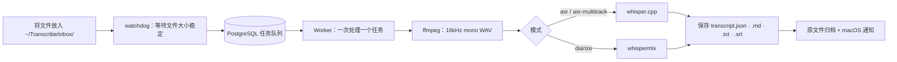

# transcribe-inbox

[English](README.md) | [한국어](README.ko.md) | **简体中文**


-lightgrey)

[](https://chuseok22.github.io/transcribe-inbox/zh/)

把录音文件放进文件夹，Apple Silicon Mac 会在本地完成转写，并保存到笔记文件夹。

> **仅支持 macOS + Apple Silicon**。不支持 Linux、Windows 和 Intel Mac。

> 本文档由 AI 翻译自韩文原文，欢迎通过 Issue 反馈翻译错误。

<!-- 演示 GIF 位置：由用户提供后插入 -->

transcribe-inbox 是一个本地后台守护进程。它监视指定的文件夹，自动转写新放入的录音文件（音频或视频），结果保存到 Obsidian vault 或普通文件夹。引擎同时使用 whisper.cpp 和 whispermlx，不调用云端 API。

只要 `ffmpeg` 能解码其中的音频，音频和视频文件都可以处理。流水线不检查文件扩展名，用 `ffmpeg` 只提取音频流。静音片段不会被裁掉，所以转写结果的时间戳始终与原文件一致。`ffmpeg` 打不开的文件只会让对应的任务失败，守护进程和其他任务不受影响。

## 主要特性

- 本地处理：所有处理都在你的 Mac 上完成，不调用云端 API。
- 用文件夹结构配置：文件放在哪一层文件夹，决定了类别和模式。没有配置文件，也没有文件名规则。
- 3 种模式：用于单一说话人的 `asr`，合并各说话人音轨的 `asr-multitrack`，以及区分同一文件中多位说话人的 `diarize`。
- 防止重复与状态恢复：按文件内容的哈希判断，内容相同的文件不会再次登记。守护进程重启后，会重新校正被中断任务的状态。
- 保存原文：结果为 `transcript.json`（正本）、`.md`、`.txt`、`.srt`。程序不做摘要，需要的话请自行整理。
- 不依赖 Obsidian：结果是保存在普通文件夹中的 Markdown、JSON、SRT 文件，用其他工具也能打开。

## 工作流程

放进收件箱的文件按下面的顺序处理。任务一次只执行一个，按顺序处理。



## 环境要求

- macOS + Apple Silicon
- 在本地运行的 PostgreSQL（任务队列和状态存储）
- `ffmpeg`
- `whisper-cli`（whisper.cpp）和 2 个模型文件（ASR 模型 `ggml-large-v3.bin`，VAD 模型 `ggml-silero-v6.2.0.bin`）
- `uv`（用于安装 Python 依赖）
- 仅在使用 `diarize` 模式时需要：HuggingFace Read 权限令牌，并同意说话人分离模型的使用条款

各项的安装方法见[前置条件](https://chuseok22.github.io/transcribe-inbox/zh/getting-started/prerequisites)和[安装指南](https://chuseok22.github.io/transcribe-inbox/zh/getting-started/installation)。

## 快速开始

下面是首次安装所需的最少步骤。安装完成后，把录音文件放到 `~/Transcribe/inbox/` 下即可。

开始前需要先创建 PostgreSQL 数据库并应用 schema，再下载 2 个模型。具体方法见[安装指南](https://chuseok22.github.io/transcribe-inbox/zh/getting-started/installation)。

```sh
brew install ffmpeg whisper-cpp
uv sync   # 应用 DB schema、下载模型请参阅安装指南
cp launchd/com.chuseok22.transcribe-inbox.plist.example launchd/com.chuseok22.transcribe-inbox.plist   # 请填入相应的值
cp launchd/com.chuseok22.transcribe-inbox.plist ~/Library/LaunchAgents/ && launchctl load ~/Library/LaunchAgents/com.chuseok22.transcribe-inbox.plist
```

要运行守护进程，需要在 plist 中填入 `uv`、`whisper-cli`、模型文件的绝对路径以及 `DATABASE_URL` 等值。详细配置见[文档](https://chuseok22.github.io/transcribe-inbox/zh/)。

## 文档

完整文档位于 [https://chuseok22.github.io/transcribe-inbox/zh/](https://chuseok22.github.io/transcribe-inbox/zh/)。

- 快速上手：[前置条件](https://chuseok22.github.io/transcribe-inbox/zh/getting-started/prerequisites)、[安装](https://chuseok22.github.io/transcribe-inbox/zh/getting-started/installation)
- 指南：[收件箱目录结构](https://chuseok22.github.io/transcribe-inbox/zh/guide/inbox-layout)、[模式](https://chuseok22.github.io/transcribe-inbox/zh/guide/modes)、[使用方法](https://chuseok22.github.io/transcribe-inbox/zh/guide/usage)
- 参考：[配置](https://chuseok22.github.io/transcribe-inbox/zh/reference/configuration)、[输出格式](https://chuseok22.github.io/transcribe-inbox/zh/reference/output)
- 故障排查：[故障排查](https://chuseok22.github.io/transcribe-inbox/zh/help/troubleshooting)、[已知限制](https://chuseok22.github.io/transcribe-inbox/zh/help/known-limitations)

## 已知限制

目前已知的限制如下。

- whisper.cpp 没有固定到特定的 git 标签或提交。`brew install whisper-cpp` 安装的 `stable` 版本变化时，行为可能随之改变。
- `diarize` 模式还没有用真实录音做过端到端测试。依赖这个模式之前，请先做一次冒烟测试。
- 两段不同录音的类别和标签相同时，转写结果目录会被覆盖。原始音频有内容哈希后缀保护，转写结果目前还没有。
- `HUGGINGFACE_TOKEN` 需要直接写进已被 gitignore 忽略的 plist 文件。暂不支持钥匙串或单独的密钥文件。
- 直接放在收件箱根目录的文件，类别名称为 `미분류`（未分类）。这个名称写死在代码中，无法更改。
- 转写语言目前固定为韩语（`ko`），暂不能设置为其他语言。

详情见[已知限制](https://chuseok22.github.io/transcribe-inbox/zh/help/known-limitations)页面。

## 参与贡献

贡献方式见 [CONTRIBUTING.md](CONTRIBUTING.md)。修改 README 时，以韩文版（`README.ko.md`）为原文，并同时更新英文和中文译本。

## 许可证

采用 MIT 许可证，详见 [LICENSE](LICENSE)。
